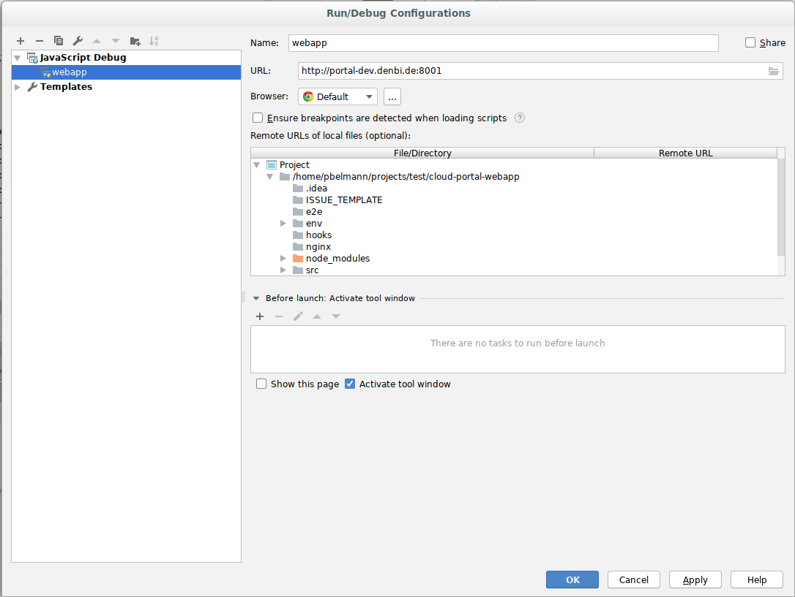

# Cloud Portal Web App

This app provides access to the Portal-API and to the Perun API.

## Production

### Run

You can run the webapp using docker:

```BASH
docker run -e ANGULAR_MODE=prod -p 80:80 denbicloud/cloud-portal-webapp:RELEASE
```

You can find current releases on GitHub.

**Note**: The cloud-api server must also be running.

## Development

### Project Setup

1. Clone the cloud-portal-webapp repository.

```BASH
git clone -b dev git@github.com:deNBI/cloud-portal-webapp.git
cd cloud-portal-webapp
```

2. Install nodejs virtual environment as described [here](https://github.com/ekalinin/nodeenv#install).

3. Run the Makefile

```BASH
make
```

The default target checks if steps 1 - 3 were executed and then creates a node-environment, followed by installing all needed npm packages and angular cli (by running npm install and npm install -g @angular/cli).
For more makefile targets run help.

```BASH
make help
```

4. Start the angular server with make or by yourself

```BASH
make serve
```

or

```BASH
. env/bin/activate
ng serve
```

the dev server should run now on localhost:8001.
The app will automatically reload if you update any of the source files.

### Debug with Intellij

#### 1.Setup

You must first setup and start the project as described in the **Project Setup** section.

#### 2.Enable Javascript debugging

Enable Javascript debugging by choosing JavaScript Debug in your Run/Debug configurations



#### 3. Once you start the Debug mode a browser window should pop up.

### Build

Run `ng build` to build the project. The build artifacts will be stored in the `dist/` directory.

### Code scaffolding

Run `ng generate component component-name` to generate a new component. You can also use `ng generate directive/pipe/service/class/module`.

### Running unit tests

Run `ng test` to execute the unit tests via [Karma](https://karma-runner.github.io).

### Running end-to-end test with Playwright

[Playwright](https://playwright.dev) is used to run end-to-end tests.
As Playwright is part of the packages from the repository's `package.json` it is available when sourcing your virtual
environment also used for serving the web-app locally. In case you encounter any problems, install it by hand as described
[here](https://playwright.dev/docs/intro#manually).
There is an environment template, which can be found under `tests/environment_template.json`. This template needs to be adjusted and saved as `environment.json` to define user logins and the location of the portal for testing. A suitable `environment.json` can be found on our CeBiTec volume, using the path `/prj/denbi_cloud_portal_dev/environment.json`.

Before running the tests make sure you are serving the app via `ng serve`.
Run `npx playwright test` in the projects root directory to execute all end-to-end tests.
By default, the tests run in the background, use the `--headed` flag to observe the tests in your browser.
To run single test files or a set of tests files, just add the corresponding file-paths to the command, e.g. `npx playwright test tests/simple_vm_application_spec.ts`.

For writing tests the [documentation](https://playwright.dev/docs/intro) provided by Playwright is helpful, especially the guides on
[selectors](https://playwright.dev/docs/selectors) and [locators](https://playwright.dev/docs/locators).

After the tests finished, a test summary is shown in your web browser.

### Further help

To get more help on the Angular CLI use `ng help` or go check out the [Angular CLI README](https://github.com/angular/angular-cli/blob/master/README.md).

### Documentation

We are using [Compodoc](https://compodoc.app/guides/getting-started.html) to visualize the code written in TypeScript-files.

#### Installation

- You can install Compodoc with npm:

```BASH
npm install
```

#### Usage

- Comment your code written in TypeScript-files. Comment-syntax is equivalent to Javascript.

Example:

```javascript
  /**
   * Uses the data from the application form to fill the confirmation-modal with information.
   * @param f the application form with corresponding data
   */
  filterEnteredData(f: NgForm) {
  ...
```

- Use the following commands to let Compodoc analyze the written code and comments.

```BASH
npm run compodoc
```

- To view the created documentation, use your favorite webbrowser (e.g. firefox)

```BASH
firefox documentation/overview.html
```

### Linting

### Tool: ESLint

We currently use the [ESLint](https://eslint.org) tool for linting the web app.
The current configuration is based on the standard ESLint rules combined with the [Airbnb Style Guide](https://github.com/airbnb/javascript).
This style guide is designed for plain javascript, so some adjustments have been made due to the use of TypeScript, as well as project-specific circumstances.
The adapted rules can be found in the [configuration file](https://github.com/deNBI/cloud-portal-webapp/blob/master/.eslintrc.json).
